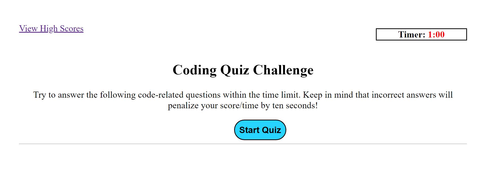

# 04-Coding-Quiz

## Description

A timed quiz on JavaScript fundamentals was requested by the client.  The purpose of the application would be to gauge the progress of students as compared to their peers.  No code was provided for the application.  All code presented in this application was created by the author.

## Website URL

https://chilejay7.github.io/04-Coding-Quiz/

## Usage

A screenshot of the website design is included below for reference.  Clicking the Start button will start the timer and countdown until there is no time left.  The first question will be presented after clicking Start.  A set amount of time will be given to answer as many of the questions as possible.  Each incorrect answer will subtract ten seconds from the time available.  At the end of the time the user will be able to save their initials and score. All score data is saved to local storage and can be recalled at any time by using the View High Scores link at the top of the page.

## Credits

Credit to Louis Lazaris and his blog post that provided the skeleton of the code that was used to create an event listener on each of the answer list buttons.  The blog post can be referenced at the following link: https://www.codeinwp.com/snippets/add-event-listener-to-multiple-elements-with-javascript/#gref.

## License

Please refer to the LICENSE in the repo.